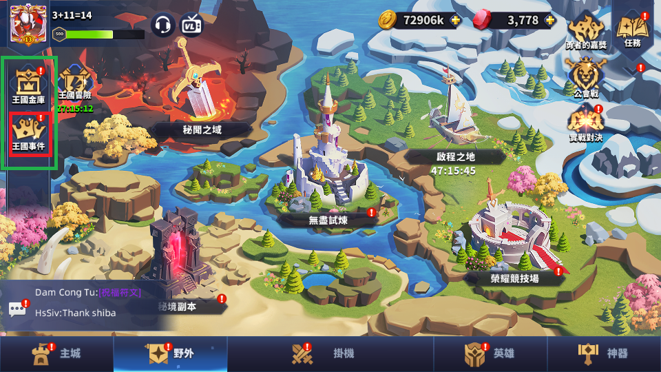

# 異界奇聞：全自動點廣告系統規格書與開發報告

## 1. 系統總覽 (System Overview)
本專案的目標是打造一個全自動的 Android 模擬器腳本，能夠：
1. 自動從遊戲任何畫面（主城、野外、掛機）導航進入「異界奇聞」。
2. 自動尋找並點擊 4 個「免費」廣告。
3. 看完廣告後自動點擊 X 關閉，並處理遊戲內的各種干擾（如獲得道具的彈跳視窗、灰色已售完按鈕等）。
4. 在發生無法辨識的錯誤時，自動擷取錯誤畫面並呼叫小畫家通知使用者。

---

## 2. 導航規格與特徵擷取 (Navigation Spec)

### 2.1 導航路徑與使用者提供之原始參考大圖
無論位於主畫面哪一個分頁，進入廣告大廳的唯一路徑為：
- **步驟 1**：點擊畫面最左側的「王國事件」圖示。
  - 原始參考大圖：
- **步驟 2**：在展開的左側選單中，點擊「異界奇聞」長條按鈕。
  - 原始參考大圖：

### 2.2 圖像辨識特徵修正歷程與最新設定

**特徵 A：王國事件 (nav_kingdom.png)**
- **說明**：這是位於主城、野外、掛機分頁左側的入口按鈕。
- **錯誤擷取歷史**：最初我們擷取的特徵僅包含下方文字部分，導致因為背景（草地、冰雪）改變而無法正確辨識。
- **重新裁切說明**：已捨棄舊版僅裁切文字的部分，改為裁切包含上方黃色皇冠的完整圖示。
- **使用者標示區域**：
- **最新精確特徵圖**：

**特徵 B：異界奇聞 (nav_otherworld.png)**
- **說明**：選單展開後，位於左側列表中的按鈕。
- **錯誤擷取歷史**：在前一次裁切時，誤將使用者使用小畫家畫上去的「紅框」也一起裁切進去了。
- **重新裁切說明**：已去除紅框瑕疵，僅保留乾淨的按鈕內部圖像。
- **使用者標示區域**：
- **最新精確特徵圖**：

---

## 3. 廣告點擊完整規格 (Ad Interaction Spec)

### 3.1 尋找綠色免費按鈕 (Sweep Ads)
- **過濾機制**：為了避免誤判灰色的「已售完」按鈕，程式**不依賴**單純的圖像範本比對（Template Matching），而是採用 HSV 色彩空間尋找精確的「綠色」區塊。
- **防呆設計**：不僅找綠色，還嚴格限定綠色區塊的面積（500 ~ 15000 像素）與長寬比（1.5 ~ 6.0）。這能避免程式誤將主畫面的大片綠色草地當成廣告按鈕。

### 3.2 廣告關閉與例外處理 (Find Close & Verify)
- **尋找與關閉 X**：當點擊廣告後，程式進入 `FIND_CLOSE` 狀態，開始長達 120 秒的計時等待。期間會不斷掃描畫面上是否有出現預先錄製好的「X 按鈕」特徵並點擊。若成功點擊則進入驗證階段。
- **彈窗干擾處理**：關閉廣告回到大廳後，遊戲經常會彈出「獲得道具」的視窗，這會導致背景變暗（Dimmed），使綠色按鈕找尋失敗。
  - **解決方案**：程式若在此階段找不到下一個綠色按鈕，會先自動盲點畫面左下角 `(50, 500)`（安全空白區域）來點掉可能存在的獎勵視窗，然後再次掃描。

---

## 4. 錯誤處理與報警機制 (Error Handling & Blocker)

當系統進入無法辨識的狀態（例如：導航找不到按鈕、尋找 X 按鈕超過 120 秒）時，將觸發**防呆錯誤處理機制**：

1. **強制停止**：狀態機立刻切換至 `FAILED`，停止所有自動點擊行為，防止誤觸商城或其他危險區域。
2. **擷取現場畫面**：自動儲存當下的模擬器畫面至 `ads/debug/` 資料夾中（檔名帶有發生時間）。
3. **自動呼叫小畫家 (目前遭遇的卡關點 Blocker)**：
   - **規格要求**：程式在擷取完錯誤畫面後，必須自動在使用者的 Windows 桌面上透過小畫家 (mspaint) 彈出該圖片，強制提醒使用者並要求用紅框標記正確位置。
   - **當前遭遇瓶頸**：由於我們的核心 Python 腳本是運行在背景服務（Session 0 隔離），當程式呼叫 `os.system("mspaint")` 時，Windows 的安全機制會將小畫家開啟在背景，導致使用者無法在桌面上看見。
   - **SOP 解決方案**：發生錯誤時，請使用者手動開啟 PowerShell，並輸入以下指令來突破系統隔離，手動觸發小畫家：
     ```powershell
     cd E:\antigravity\adb_vl
     .\.venv\Scripts\python.exe ads\capture.py --tag manual_check
     ```
