# Valor Legends 遊戲導航圖與操作邏輯文件

本文件旨在建立一個可重用的遊戲導航知識圖譜（Navigation Graph），將各遊戲頁面視為節點（Nodes），跳轉按鈕與操作路徑視為方向邊（Edges）。後續開發、除錯或接手的 Agent 應以此文件為導引進行自動化操作與測試。

---

## 1. 保守協作模式規範 (Conservative Collaboration Guidelines)

在操作模擬器時，必須遵循**極度保守**原則。若遇到以下任一情況，**立即停止一切自動化操作，並向使用者回報請示**，嚴禁自行猜測或嘗試點擊：

1. **未知彈窗出現**：畫面出現非預期的新彈窗或引導畫面，且無法 100% 確定關閉/取消按鈕的意義。
2. **資源消耗風險**：點擊可能消耗鑽石、金幣、召喚券、挑戰次數或其他遊戲內關鍵道具資源。
3. **敏感操作行為**：點擊可能觸發開始戰鬥、掃蕩（Sweep）、購買、升級、抽卡、領取獎勵等行為。
4. **導航卡死**：嘗試了 Back 鍵（keyevent 4）、左上角返回箭頭 `(50, 60)`、或切換主城頁籤等常規路徑，仍無法安全返回每日任務頁面。
5. **畫面嚴重偏離**：當前畫面與已有截圖差異巨大，無法辨識所在頁面節點。
6. **判定信心不足**：圖像匹配（Template Matching）或文字去重判定相似度落在灰色地帶，無法確保點擊準確度。
7. **任務重複判定存疑**：無法確定某個任務是否已被點擊探測過。

---

## 2. 導航圖譜結構 (Mermaid Diagram)

```mermaid
graph TD
    %% 節點定義
    daily_tasks["每日任務頁 (daily_tasks)"]
    main_campaign["主城/掛機首頁 (main_campaign)"]
    midas_touch["點金手彈窗 (midas_touch)"]
    time_travel["時間旅行彈窗 (time_travel)"]
    secret_realm["秘境副本頁 (secret_realm)"]
    arena_page["競技場頁面 (arena_page)"]
    bounty_board["懸賞委託頁 (bounty_board)"]
    summon_gate["召喚法陣/高級契約 (summon_gate)"]
    guild_wish["公會祈願彈窗 (guild_wish)"]
    hero_list["英雄/裝備列表 (hero_list)"]
    guild_dungeon["公會副本頁 (guild_dungeon)"]
    elite_node["精英據點頁 (elite_node)"]
    endless_trial["無盡試煉頁面 (endless_trial)"]

    %% 方向邊定義
    main_campaign -- "點擊 任務 1555,100" --> daily_tasks
    daily_tasks -- "點擊 前往 1399,664" --> midas_touch
    daily_tasks -- "點擊 前往 1400,502" --> time_travel
    daily_tasks -- "點擊 前往 1399,789" --> secret_realm
    daily_tasks -- "點擊 前往 1400,752" --> arena_page
    daily_tasks -- "點擊 前往 1400,386" --> bounty_board
    daily_tasks -- "點擊 前往 1399,640" --> summon_gate
    daily_tasks -- "點擊 前往 1399,425" --> guild_wish
    daily_tasks -- "點擊 前往 1399,675" --> hero_list
    daily_tasks -- "點擊 前往 1399,550" --> guild_dungeon
    daily_tasks -- "點擊 前往 1399,414" --> endless_trial
    guild_dungeon -- "進入戰場" --> elite_node

    %% 返回邊 (綠色為安全返回路徑)
    midas_touch -- "X按鈕 或 Keyevent 4" --> daily_tasks
    time_travel -- "取消/X按鈕 或 Keyevent 4" --> daily_tasks
    guild_wish -- "X按鈕 或 Keyevent 4" --> daily_tasks
    
    secret_realm -- "左上返回 50,60" --> daily_tasks
    arena_page -- "左上返回 50,60" --> daily_tasks
    bounty_board -- "左上返回 50,60" --> daily_tasks
    summon_gate -- "左上返回 50,60" --> daily_tasks
    guild_dungeon -- "左上返回 50,60" --> daily_tasks
    elite_node -- "左上返回 50,60" --> guild_dungeon
    endless_trial -- "Android Back 或 Keyevent 4" --> daily_tasks

    hero_list -- "無法直接退出 (Back彈窗)" --> main_campaign
    main_campaign -- "點擊 任務 1555,100" --> daily_tasks
```

---

## 3. 節點詳細資訊 (Node Profiles)

### 節點 1：每日任務頁面 (`daily_tasks`)
* **進入頁面**：從掛機首頁點擊 `(1555, 100)` 的「任務」按鈕。
* **安全返回方式**：點擊左上角黃色返回鍵 `(50, 60)` 退回主畫面。
* **風險按鈕**：各任務進度條右側的「領取」按鈕（可能誤領取獎勵，測試階段請避免點擊）。
* **可用截圖**：`screenshots/dailyTasks.png`
* **可用 Template**：`assets/daily_tasks_title.png`（用以檢測是否在每日任務頁，匹配信心閾值應大於等於 `0.85`）。
* **需要等待時間**：`2.0` 秒。

---

### 節點 2：點金手彈窗 (`midas_touch`)
* **進入頁面**：在每日任務頁點擊「完成1次點金手」對應的「前往」`(1399, 664)`。
* **安全返回方式**：點擊右上角「X」圖案 `(1420, 140)` 或發送 Android Back 鍵 `keyevent 4`。
* **風險按鈕**：
  * 「免費領取」按鈕 `(270, 820)`（測試期請勿點擊，會完成點金手並消耗每日次數）。
  * 鑽石購買按鈕 `(480, 820)`、`(700, 820)`（消耗鑽石，嚴禁點擊）。
* **可用截圖**：`screenshots/probe_002_after.png`
* **需要等待時間**：`2.0` 秒。

---

### 節點 3：時間旅行彈窗 (`time_travel`)
* **進入頁面**：在每日任務頁點擊「完成1次時間旅行」的「前往」。
* **安全返回方式**：點擊左下角「取消」按鈕 `(590, 770)` 或「X」按鈕或發送 `keyevent 4`。
* **風險按鈕**：右側綠色「免費」或鑽石消耗按鈕（會消耗旅行次數與資源）。
* **可用截圖**：`screenshots/probe_004_after.png`
* **需要等待時間**：`2.0` 秒。

---

### 節點 4：秘境副本頁面 (`secret_realm`)
* **進入頁面**：在每日任務頁點擊「挑戰/掃蕩任意秘境副本3次」的「前往」`(1399, 789)`。
* **安全返回方式**：點擊左上角金黃色返回箭頭 `(50, 60)` 直退回每日任務頁。
* **風險按鈕**：畫面右下角「掃蕩」與「掃蕩全部」按鈕（會消耗副本次數與資源，請勿點擊）。
* **可用截圖**：`screenshots/probe_008_after.png`
* **需要等待時間**：`4.5` 秒（包含地圖 3D 渲染與黑屏轉場）。

---

### 節點 5：懸賞委託頁面 (`bounty_board`)
* **進入頁面**：在每日任務頁點擊「接取2個懸賞委託」的「前往」。
* **安全返回方式**：點擊左上角金黃色返回箭頭 `(50, 60)`。
* **風險按鈕**：列表項右側藍色「接受」按鈕，或底部的「全部接受」/「免費刷新」按鈕（會接取任務或消耗刷新次數）。
* **可用截圖**：`screenshots/probe_007_after.png`
* **需要等待時間**：`3.0` 秒。

---

### 節點 6：高級契約召喚頁面 (`summon_gate`)
* **進入頁面**：在每日任務頁點擊「完成1次高級契約召喚」的「前往」。
* **安全返回方式**：點擊左上角金黃色返回箭頭 `(50, 60)`。
* **風險按鈕**：左下「免費」/「召喚x10」按鈕，以及右下「友情契約」、「召喚x1」等按鈕（會消耗召喚券或鑽石，請勿點擊）。
* **可用截圖**：`screenshots/probe_009_after.png`
* **需要等待時間**：`4.5` 秒（傳送門特效加載較慢）。

---

### 節點 7：公會祈願彈窗 (`guild_wish`)
* **進入頁面**：在每日任務頁點擊「進行1次公會祈願」的「前往」。
* **安全返回方式**：點擊右上角「X」關閉按鈕，或發送 `keyevent 4`。
* **風險按鈕**：卡牌下方的「免費」按鈕、鑽石「100」/「200」按鈕（會消耗祈願次數與鑽石）。
* **可用截圖**：`screenshots/probe_011_after.png`
* **需要等待時間**：`2.0` 秒。

---

### 節點 8：英雄/裝備列表頁面 (`hero_list`)
* **進入頁面**：在每日任務頁點擊「強化1次裝備」的「前往」。
* **安全返回方式（特殊重建序列）**：
  1. 此頁面底欄按鈕雖然可見，但屬於鎖定狀態（點擊無響應）。
  2. 直接發送返回鍵會觸發「退出遊戲」提示。
  3. **安全退出路徑**：
     * 發送返回鍵 `keyevent 4`。
     * 點擊「否」`(385, 745)` 關閉退出遊戲對話框。
     * 點擊底欄「掛機」分頁 `(800, 840)`（切換到主城大地圖）。
     * 在主城大地圖點擊右上角「任務」鍵 `(1555, 100)` 重新打開每日任務。
* **風險按鈕**：點擊英雄頭像或底欄「英雄」分頁中的其他強化功能，可能導致誤消耗金幣/精華升級英雄或裝備。
* **可用截圖**：`screenshots/probe_013_after.png`
* **需要等待時間**：`3.0` 秒。

---

### 節點 9：公會副本與精英據點頁面 (`guild_dungeon` & `elite_node`)
* **進入頁面**：在每日任務頁點擊「成功通關2次公會副本挑戰」的「前往」`(1399, 550)`。
* **首次進入特徵**：會出現一個引導彈窗（玩法說明）。必須點擊彈窗外任意區域關閉引導，才能看到據點地圖。
* **安全返回方式**：
  * 若在**精英據點頁**（如 27號精英據點，有黃色挑戰按鈕）：點擊左上角返回箭頭 `(50, 60)`，退回到公會副本主地圖。
  * 若在**公會副本主地圖**：再次點擊左上角返回箭頭 `(50, 60)`，退回到每日任務頁。
* **風險按鈕**：
  * 精英據點內部的「挑戰」按鈕 `(800, 820)`、「訓練」按鈕。
  * 右下角的「增益效果商店」、「排行榜」等分頁。
* **可用截圖**：
  * 公會副本玩法引導：`screenshots/probe_015_after.png`
  * 精英據點主頁面：`screenshots/current.png` (27號精英據點)
* **需要等待時間**：`4.5` 秒。

---

### 節點 10：無盡試煉頁面 (`endless_trial`)
* **進入頁面**：在每日任務頁點擊「挑戰1次無盡試煉」的「前往」`(1399, 414)`。
* **安全返回方式**：發送 Android Back 鍵 `keyevent 4` 直接退回每日任務頁。
* **風險按鈕**：各關卡（哀怨鐘樓、信仰階梯、通天神木）內部的「挑戰」按鈕或戰鬥按鈕。
* **可用截圖**：`screenshots/probe_001_after.png`
* **需要等待時間**：`4.5` 秒。

---

## 4. 下一次遇到相同畫面的操作指南

當後續 Agent 執行自動化，被轉場到某個頁面時，應依據以下流程進行比對與退回：

1. **截圖並與 `Node Profiles` 中的參考截圖進行對照**。
2. **比對頂部標題與特徵圖標**。
3. **執行該 Node 對應的「安全返回方式」**：
   * 優先嘗試關閉彈窗（如 X 按鈕）。
   * 若為懸賞、競技場、秘境、副本等整頁場景，點擊左上角 `(50, 60)`。
   * 若為英雄列表等鎖定場景，執行「否 -> 掛機 -> 任務」的四步召回路徑。
4. **驗證是否回到 `daily_tasks` 頁面（使用 `assets/daily_tasks_title.png`）**。若未成功，立即停下，不要盲目重複點擊。
