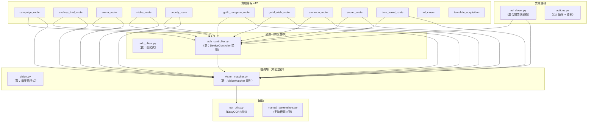
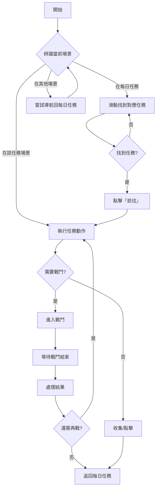
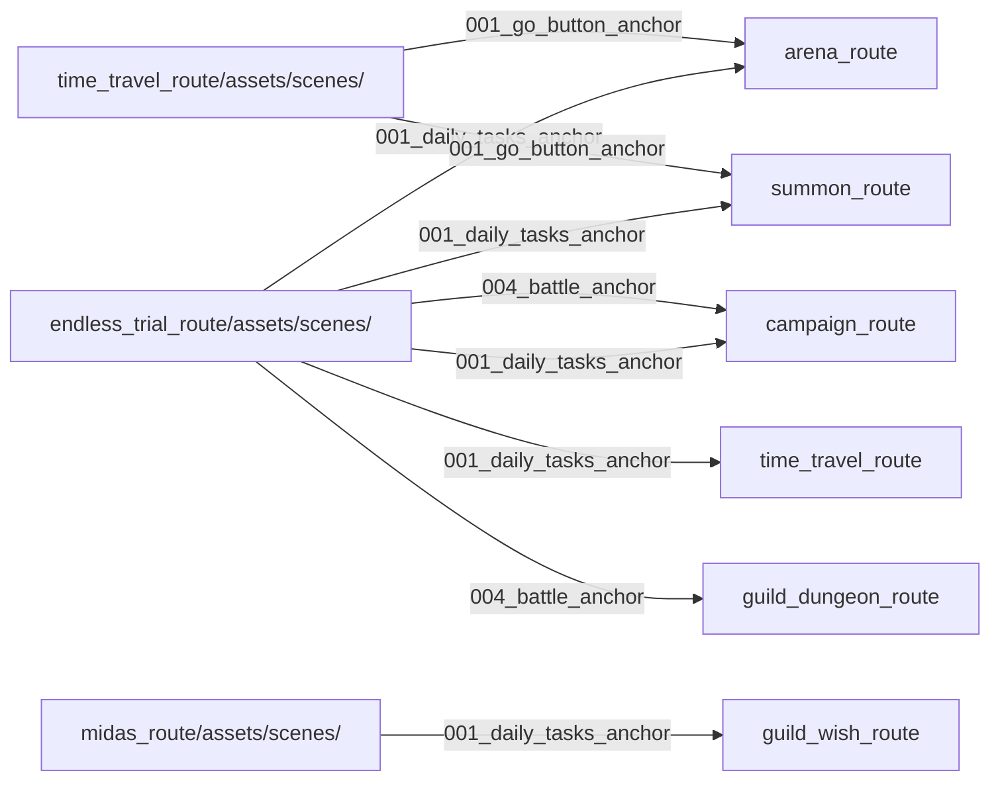

# Valor Legends ADB 自動化專案 — 完整分析報告

> 產生時間：2026-06-04  
> 分析範圍：`src/`、`experiments/`（12 路線）、`docs/`、`assets/`、`manual_screenshots/`、`tools/`、`data/`

---

## 目錄

1. [專案總覽](#1-專案總覽)
2. [架構分析](#2-架構分析)
3. [各任務路線現狀](#3-各任務路線現狀)
4. [共通模式與重複代碼](#4-共通模式與重複代碼)
5. [已知問題與風險](#5-已知問題與風險)
6. [待釐清問題（需要你的回覆）](#6-待釐清問題需要你的回覆)
7. [重構計劃](#7-重構計劃)

---

## 1. 專案總覽

### 技術路線
```
ADB 截圖 → OpenCV Template Matching + EasyOCR → ADB tap/swipe
```
- 純外部 UI 自動化，無封包攔截、無記憶體修改、無 APK 注入
- 目標：自動完成 Valor Legends（勇者傳說）每日任務

### 核心依賴
| 套件 | 用途 |
|------|------|
| `opencv-python` | Template matching、圖像處理 |
| `numpy` | 圖像陣列 |
| `easyocr` | 文字辨識（任務名稱、戰力數字） |

### 目前狀態
- **主要開發在 `experiments/`**，共 12 個子目錄，每個是獨立腳本
- `src/` 有基礎模組（`DeviceController`、`VisionMatcher`、`AdCloser`）但整合度不高
- 各路線「能跑但不穩定」，缺乏統一的錯誤處理和場景跳轉

---

## 2. 架構分析

### 2.1 模組層次



### 2.2 雙軌問題

| 層面 | 舊版 | 新版 | 狀態 |
|------|------|------|------|
| ADB 控制 | `adb_client.py`（函式） | `adb_controller.py`（DeviceController） | 新版為主，舊版可移除 |
| 視覺比對 | `vision.py`（檔案路徑） | `vision_matcher.py`（VisionMatcher） | 新版為主，舊版可移除 |

### 2.3 關鍵類別

#### `DeviceController` (adb_controller.py)
```
connect / screenshot / tap / swipe / back / long_press / get_screen_size
```

#### `VisionMatcher` (vision_matcher.py)
```
match_template / match_any / match_all / match_best / find_text_region / load_templates
```
- 支援 ROI（分數或像素）
- 支援 mask（透明 template）
- Debug 模式可輸出帶 bbox 截圖

#### `AdCloser` (ad_closer.py)
- 最成熟的狀態機：`WAIT_AD → SCAN_CLOSE → TAP_CLOSE → VERIFY → DONE/FAILED`
- 掃描四角 ROI、grace period、max_taps

### 2.4 導航圖（已定義但未使用）

`data/status_graph.json` 定義了完整的螢幕節點和轉場：
- 18 個螢幕節點（main_lobby、daily_tasks、campaign_select 等）
- 每個節點有 anchors、transitions、actions
- **但目前沒有任何腳本讀取或使用此 JSON**

---

## 3. 各任務路線現狀

### 3.1 任務分類

| 類型 | 路線 | 說明 |
|------|------|------|
| 🗡️ 戰鬥型 | campaign（戰役）、endless_trial（無盡試煉）、arena（競技場）、guild_dungeon（公會副本）、secret（秘境副本） | 需要進入戰鬥 → 等待結束 → 處理結果 |
| 💰 收集型 | midas（點金手）、guild_wish（公會祈願）、summon（高級召喚）、time_travel（時間旅行） | 點擊收集/使用，無戰鬥 |
| 📋 派遣型 | bounty（懸賞委託） | 派遣英雄、領取完成獎勵 |
| 📺 工具型 | ad_closer（廣告關閉）、template_acquisition（模板擷取） | 輔助功能 |

### 3.2 各路線詳細狀態

> [!NOTE]
> 成熟度排序：endless_trial > campaign ≈ arena ≈ midas ≈ guild_dungeon > time_travel ≈ summon ≈ secret_realm ≈ guild_wish > bounty（未完成）

| 路線 | 入口方式 | 戰鬥處理 | 特殊機制 | 穩定度 |
|------|----------|----------|----------|--------|
| **campaign** | 每日任務→滑動找「戰役」→前往 | 單隊戰鬥循環 | 無 | ⚠️ 中 |
| **endless_trial** | 每日任務→滑動找「無盡試煉」→前往 | 單隊 + 每5關多隊（3或5隊） | 多隊組隊介面 | ⚠️ 中 |
| **arena** | 每日任務→滑動找「競技場」→前往 | 單隊對戰×5次 | OCR 讀取對手戰力 | ⚠️ 中 |
| **midas** | 每日任務→滑動找「點金手」→前往 | 無 | 點擊金手按鈕 | ✅ 較穩 |
| **bounty** | 每日任務→滑動找「懸賞」→前往 | 無 | 派遣/領取按鈕 | ⚠️ 中 |
| **guild_dungeon** | 每日任務→滑動找「公會副本」→前往 | 公會戰鬥 | 需要有公會 | ❓ 未知 |
| **guild_wish** | 每日任務→滑動找「公會祈願」→前往 | 無 | 祈願按鈕 | ⚠️ 中 |
| **summon** | 每日任務→滑動找「召喚」→前往 | 無 | 免費/廣告召喚 | ⚠️ 中 |
| **secret** | 每日任務→滑動找「秘境」→前往 | 副本戰鬥 | 不同秘境關卡 | ⚠️ 中 |
| **time_travel** | 每日任務→滑動找「時間旅行」→前往 | 無 | 獎勵收集 | ⚠️ 中 |

### 3.3 每條路線共通流程



---

## 4. 共通模式與重複代碼

### 4.1 各路線 `match_single_template()` 的差異

`match_single_template()` 函式在 **9 個檔案中被複製貼上**，各版本略有不同：

| 路線 | ROI 格式 | 多尺度 | 備註 |
|------|----------|--------|------|
| endless_trial | `(y1, y2, x1, x2)` | 有（但目前只用 `[1.0]`） | 最完整版 |
| guild_dungeon | `(x, y, w, h)` | 無 | 另有 `match_multiple_templates()` |
| bounty | 無 ROI | 無 | 有 NMS 去重 |
| 其他 7 條路線 | 無 ROI | 無 | 簡單全畫面比對 |

### 4.2 Template 跨路線共用（依賴鏈）

多條路線直接引用其他路線目錄的 template，形成隱性依賴：



> [!WARNING]
> 這表示如果移動或重命名 `endless_trial_route` 的 template，會連帶影響至少 5 條其他路線。

### 4.3 重複實作的功能

以下功能在多個路線中**各自獨立實作**，是重構的首要目標：

| 功能 | 出現次數 | 差異點 |
|------|----------|--------|
| 場景偵測主循環 | 全部 | 模式相同，anchor 不同 |
| 導航到每日任務 | 10+ | 基本相同 |
| 滑動找任務標籤 + 點擊「前往」 | 10 | 有些用 label template + 動態 ROI，有些用 task_row anchor |
| 「前往」vs「領取」按鈕區分 | summon, time_travel | 防止點到已完成任務 |
| 戰鬥等待 + 結果處理 | 5 | 基本相同（雙層結果畫面需要點兩次）|
| `in_battle_combat` 戰鬥中容忍未知場景 | campaign, endless_trial | 相同模式 |
| `consecutive_unknown` 安全停機 | 9 條路線 | 閾值不同（2~10）|
| 反循環計數 `action_count` | 9 條路線 | 閾值不同（3~10）|
| Config 定義 | 12 | 各自一份 config.py |

### 4.4 OCR 的兩種用法

| 用法 | 實作 | 路線 |
|------|------|------|
| EasyOCR 文字辨識 | `src/ocr_utils.py` + `easyocr` | arena（讀對手戰力）|
| **MD5 Hash 字元辨識** | `src/ocr_utils.py` `extract_arena_powers()` | arena（固定位置讀數字）|

> Arena 的戰力讀取用的不是傳統 OCR，而是：二值化 → findContours → 裁切每個字元 → MD5 hash → 查表。優點是快，缺點是換解析度就全部失效。

### 4.5 可抽取的共用模組

```
shared/
├── navigator.py          ← 導航：go_to_daily_tasks, go_to_task(task_name)
├── daily_task_finder.py   ← 滑動尋找任務：scroll_to_task(task_label)
├── battle_handler.py      ← 戰鬥循環：wait_battle, handle_result
├── multi_team_handler.py  ← 多隊戰鬥（無盡試煉用）
├── scene_detector.py      ← 統一場景辨識
├── config.py             ← 全域 config（serial, thresholds, timing）
└── task_runner.py         ← 任務執行框架
```

---

## 5. 已知問題與風險

### 5.1 技術問題

| # | 問題 | 影響 | 嚴重度 |
|---|------|------|--------|
| 1 | **解析度變更導致 template 失效** | 所有 anchor 圖和 MD5 hash 表都需重做 | 🔴 高 |
| 2 | **template 跨路線隱性依賴** | 改一個路線的 template 可能影響其他 5+ 條路線 | 🔴 高 |
| 3 | **無統一錯誤恢復** | 任一步驟失敗後無法自動恢復 | 🔴 高 |
| 4 | **無場景跳轉邏輯** | 不在預期場景時卡住 | 🔴 高 |
| 5 | **戰鬥結束需要點兩次**（雙層結果畫面）| 只點一次會卡在獎勵畫面 | 🔴 高 |
| 6 | **EasyOCR 速度慢**（~2-3s/次） | 每次 OCR 導致整體流程變慢 | 🟡 中 |
| 7 | **MD5 hash OCR 極度脆弱** | 換解析度、字型渲染微變就全部失效 | 🟡 中 |
| 8 | **舊/新程式碼雙軌並存** | `adb_client.py` + `vision.py` 仍被 9 條路線間接使用 | 🟡 中 |
| 9 | **status_graph.json 定義了 18 節點但無程式使用** | 已做的導航圖設計被浪費 | 🟡 中 |
| 10 | **每個路線各自一套 config** | 修改 serial 等需改 12 份 | 🟡 中 |
| 11 | **assets/ad_close/ 目前是空的**（只有 README）| AdCloser 沒有可用的 template | 🟡 中 |
| 12 | **scratch/ 有 119 個測試腳本** | 難以區分哪些仍有用 | 🟢 低 |

### 5.2 穩定性風險

> [!WARNING]
> 以下情況會導致腳本卡住或誤操作：

1. **彈出廣告** — 非預期彈窗擋住操作，且 `assets/ad_close/` 目前是空的
2. **動畫延遲** — 場景轉換動畫未完成就截圖（文件記錄需要 4.5s 而非 3.0s）
3. **雙層結果畫面** — 戰鬥結束後有勝敗畫面 + 獎勵畫面，需要點兩次
4. **網路延遲** — 載入轉圈時截圖看不到預期元素
5. **伺服器維護** — 登入畫面無法自動處理
6. **遊戲更新** — UI 變更導致所有 template 失效
7. **公會副本多層彈窗** — guild_dungeon 有介紹彈窗會擋住操作

### 5.3 已知的具體 Bug（來自 docs/project_audit.md）

| Bug | 路線 | 狀態 |
|-----|------|------|
| 戰鬥結束後卡在 `unknown` 循環 | endless_trial | 已知 |
| `exit_confirm` 點擊座標 (589,401) 失效 | endless_trial | 已知 |
| 任務去重 crop 範圍錯誤（已修正為 220:650）| probe-daily-tasks | 已修正 |
| Midas 座標錯誤 | midas | 已知 |

---

## 6. 待釐清問題（需要你的回覆）

> [!IMPORTANT]
> 以下問題會影響重構方向，請逐一回覆：

### 關於遊戲機制

**Q1.** 每日任務列表中的任務順序是否固定？還是每天/每次開啟會變動？
> 這影響「滑動找任務」的策略——固定順序可以直接滑到指定位置。

每次預設順序會一樣，但執行完以後會跑到前面變成領取
我覺得要當作順序不固定

**Q2.** 每日任務總共有多少個？目前 10 個路線是否涵蓋了所有每日任務？有沒有遺漏的？
還沒有，之後還會增加


**Q3.** 「不用打贏」的定義——所有戰鬥型任務都是只要「進入戰鬥→結束」就算完成？還是有些任務需要勝利才計入？
無盡試煉和戰役關卡只有有打就可以了，所以戰鬥失敗也算達成任務
只有公會副本一定要打贏，不過目前幾乎一定會贏，所以先不用處理輸的情況，或者頂多再打一次也都會贏。

**Q4.** 無盡試煉每 5 關出現的多隊，是固定 3 隊和 5 隊，還是有其他變化？什麼時候出現 3 隊、什麼時候出現 5 隊？
無盡試煉 每五關固定三隊
戰役關卡 每五關固定五隊
但其實不太影響，因為只要有打完一次(不用三隊打完) 就算完成任務


**Q5.** 廣告會在什麼時機彈出？是否每個任務完成後都可能出現？還是只有特定操作（如點金手、召喚）才會觸發？
廣告只有在特定地方可以按廣告有收益


### 關於模擬器環境

**Q6.** 目前使用的模擬器是什麼（BlueStacks / LDPlayer / MuMu / Nox）？解析度設定是多少？
> `data/status_graph.json` 中寫的是 `127.0.0.1:5555`（BlueStacks 預設）。
blustacks，解析度你到時候自己偵測就好


**Q7.** 模擬器解析度之前和現在的變化是什麼？
> 目前截圖看起來是 960×540 為主，是否有改變過？
我不確定之前，不過之後應該就會維持這個解析度，不會故意調整


**Q8.** 是否只在一台模擬器上跑？還是需要支援多設備同時執行？
先不用管多個設備


### 關於優先順序

**Q9.** 12 個任務路線中，哪些是你最優先要穩定運行的？建議你按重要性排序。
> 目前看起來 endless_trial 和 campaign 是最成熟的。
其實都不太穩定，可以按照字母排  (看廣告先不用，不在每日任務中)


**Q10.** 最終目標是「一鍵執行全部每日任務」嗎？還是目前先各自穩定就好？
最終一定是一鍵執行，不過目前先各自穩定


**Q11.** 你希望重構的粒度是？
- A) 先整理共用模組，各路線慢慢遷移（風險低，進度慢）
- B) 整體重寫，一步到位（風險高，但架構乾淨）
- C) 先穩定 2-3 個核心路線，再擴展（推薦）

B: 然後逐個建立路線


### 關於 template 管理

**Q12.** manual_screenshots 裡的截圖是舊解析度的嗎？目前各路線的 `assets/scenes/` 裡的 anchor 圖是用什麼解析度截的？
assets/scenes/不是我截的
都是agy做的


**Q13.** 你有偏好的 template 截取方式嗎？
> 目前有兩套工具：
> - `tools/template_discovery.py` — 完整的 AI 輔助 pipeline（discover → AI analyze → crop → validate → promote）
> - `src/manual_screenshots.py` — 手動截圖 CLI 工具
> 哪個比較實用？

我都是用src/manual_screenshots.py
重構可以改位置，功能不變就好


### 關於戰鬥機制

**Q14.** 無盡試煉多隊戰鬥的流程：是需要手動為每隊選擇英雄，還是用預設陣容直接開打就好？
打開直接打就好，人數不足也沒關係


**Q15.** 懸賞委託的「不要接」規則是什麼？看到 `manual_screenshots/懸賞委託/不要接/` 有黑名單圖片，具體邏輯是？

原則上只接五星以上，但某些種類的資源不需要所以放黑名單
不過我怕程式辨識錯誤，所以初期應該會黑白名單並行，只接白名單
除非五星以上全剩下黑名單才刷新
不然就留給使用者去新增條件和自己判斷


---

## 7. 重構計劃

> [!NOTE]
> 以下計劃基於目前的分析，待你回覆 Q1-Q13 後會進一步調整。

### Phase 1：基礎整理（1-2 天）

#### 1.1 統一 Config
```python
# src/config.py — 全域設定
class Config:
    SERIAL = "127.0.0.1:5555"
    SCREENSHOT_INTERVAL = 1.5
    MATCH_THRESHOLD = 0.82
    OCR_LANG = ['en', 'ch_tra']
    
    # 路徑
    ASSETS_DIR = "assets/"
    ANCHORS_DIR = "assets/anchors/"
    SCREENSHOTS_DIR = "screenshots/"
    
    # 時間
    BATTLE_WAIT_INTERVAL = 3.0
    TRANSITION_WAIT = 2.0
    TAP_COOLDOWN = 1.0
```

#### 1.2 移除舊版程式碼
- 移除 `adb_client.py`（舊版，被 `adb_controller.py` 取代）
- 移除 `vision.py`（舊版，被 `vision_matcher.py` 取代）

#### 1.3 整理 scratch/
- 標記哪些測試腳本仍有用，移除過時的

---

### Phase 2：共用模組抽取（2-3 天）

#### 2.1 場景辨識器 `SceneDetector`
```python
class SceneDetector:
    """統一辨識當前遊戲場景"""
    
    def detect(self, frame) -> Scene:
        """回傳當前場景枚舉值"""
        # 依序嘗試所有 anchor，回傳信心值最高的
        
    def is_scene(self, frame, scene: Scene) -> bool:
        """確認是否在指定場景"""
        
    def wait_for_scene(self, scene: Scene, timeout=30) -> bool:
        """等待指定場景出現"""
```

#### 2.2 導航器 `Navigator`
```python
class Navigator:
    """處理場景間導航"""
    
    def go_to_daily_tasks(self) -> bool:
        """從任何場景導航到每日任務"""
        
    def go_to_task(self, task_name: str) -> bool:
        """在每日任務中找到並進入指定任務"""
        # 1. 確認在每日任務
        # 2. 滑動找到任務
        # 3. 點擊前往
        
    def scroll_to_find(self, target_label: str) -> Optional[MatchResult]:
        """在可滑動列表中尋找目標"""
        
    def return_to_daily_tasks(self) -> bool:
        """從任務場景返回每日任務"""
```

#### 2.3 戰鬥處理器 `BattleHandler`
```python
class BattleHandler:
    """統一處理戰鬥流程"""
    
    def start_battle(self) -> bool:
        """點擊挑戰/開始按鈕"""
        
    def wait_for_battle_end(self, timeout=120) -> bool:
        """等待戰鬥結束"""
        
    def handle_result(self) -> BattleResult:
        """處理戰鬥結果（勝/敗/超時）"""
        
    def handle_multi_team(self, team_count: int) -> bool:
        """處理多隊戰鬥（無盡試煉）"""
```

#### 2.4 任務框架 `TaskRunner`
```python
class TaskRunner:
    """所有任務的基底類別"""
    
    def run(self):
        """主循環：辨識場景 → 做相應的事 → 反覆"""
        while not self.is_done():
            scene = self.detector.detect(self.ctrl.screenshot())
            self.handle_scene(scene)
    
    def handle_scene(self, scene: Scene):
        """子類別覆寫：各場景的處理邏輯"""
        raise NotImplementedError
```

---

### Phase 3：路線遷移（每條 0.5-1 天）

優先順序建議（待你確認）：
1. **midas_route** — 最簡單，適合驗證框架
2. **campaign_route** — 標準戰鬥型，驗證 BattleHandler
3. **endless_trial_route** — 加入多隊邏輯
4. **arena_route** — 加入對手選擇
5. 其餘路線依序遷移

每條路線遷移時：
1. 重新截取該解析度下的 template
2. 用 `TaskRunner` 框架重寫
3. 測試通過後移除 `experiments/` 中的舊版

---

### Phase 4：主控腳本（1 天）

```python
# src/daily_runner.py — 每日任務主控
class DailyRunner:
    """依序執行所有每日任務"""
    
    TASK_ORDER = [
        MidasTask,
        CampaignTask,
        EndlessTrialTask,
        ArenaTask,
        BountyTask,
        GuildDungeonTask,
        GuildWishTask,
        SummonTask,
        SecretRealmTask,
        TimeTravelTask,
    ]
    
    def run_all(self):
        for TaskClass in self.TASK_ORDER:
            task = TaskClass(self.ctrl, self.vm, self.navigator)
            try:
                task.run()
            except TaskFailedError:
                logger.error(f"{TaskClass.__name__} 失敗，跳到下一個")
                self.navigator.go_to_daily_tasks()
                continue
```

---

### Phase 5：穩定性提升（持續）

- [ ] 加入全域廣告偵測（任何場景都可能彈廣告）
- [ ] 加入超時自動恢復（back 鍵 → 重新辨識場景）
- [ ] 加入日誌系統（每步截圖 + 辨識結果記錄）
- [ ] 考慮多尺度 template matching 應對微小解析度差異
- [ ] 活用 `status_graph.json` 做導航路徑規劃

---

### 重構後的目標架構

```
src/
├── config.py              ← 全域設定
├── adb_controller.py      ← ADB 裝置控制
├── vision_matcher.py      ← 視覺比對引擎
├── ocr_utils.py           ← OCR 工具
├── scene_detector.py      ← 場景辨識器（新）
├── navigator.py           ← 導航器（新）
├── battle_handler.py      ← 戰鬥處理器（新）
├── task_runner.py         ← 任務基底框架（新）
├── ad_closer.py           ← 廣告關閉（保留）
├── daily_runner.py        ← 主控腳本（新）
├── tasks/
│   ├── __init__.py
│   ├── midas.py           ← 點金手任務
│   ├── campaign.py        ← 戰役任務
│   ├── endless_trial.py   ← 無盡試煉任務
│   ├── arena.py           ← 競技場任務
│   ├── bounty.py          ← 懸賞委託任務
│   ├── guild_dungeon.py   ← 公會副本任務
│   ├── guild_wish.py      ← 公會祈願任務
│   ├── summon.py          ← 高級召喚任務
│   ├── secret_realm.py    ← 秘境副本任務
│   └── time_travel.py     ← 時間旅行任務
└── main.py                ← CLI 入口
```

---

> [!TIP]
> 請先回覆第 6 節的 Q1-Q13，我會根據你的回覆調整重構計劃的優先順序和具體實作方式。


----------------------------------------
補充問題
  ### 1. Template 的集中管理與存放位置
  目前各任務的 template（如  001_daily_tasks_anchor.png ）散落在各個  experiments/<route>/assets/scenes/
  資料夾下，且有互相依賴的情況。
  在重構後，我預計將所有 template 集中到根目錄的  assets/  底下統一管理（例如：共用的放  assets/shared/
  ，特定任務的放  assets/tasks/campaign/  等）。
  問題： 你同意這種集中式的目錄結構嗎？在重構初期，我會寫一個腳本將現有的 template
  搬移並重新組織，或者你希望保留原本的結構？

Ans.: 可以重新組織，我只管手動截圖的部分

  ### 2. 模擬器解析度自適應 (Auto-detection)

  你提到模擬器目前是 960×540 且不會刻意更改，但也提到「解析度到時候自己偵測就好」。
  現有的  VisionMatcher  主要是 1:1 比對。如果要做到「自適應解析度」，我們有兩種做法：

  • 做法 A（簡單高效）：腳本啟動時偵測解析度，如果不是 960×540 就報錯提示，要求在相同解析度下執行或重新截圖。（因為
  template 都是基於這個解析度截的）
  • 做法 B（多尺度比對）：偵測當前解析度與 960×540 的比例，使用 OpenCV 的  resize  或多尺度 (multi-scale) 來縮放
  template 進行比對。這會稍微降低執行速度。
  問題： 初期重構你傾向哪一種做法？（建議先用 A，最穩定，等框架成型後再加入 B）

Ana.: 同意作法A，但對於已有的截圖如果不堪用的話由agent自行去截自己堪用的，如果找不到場景再跟我說


  ### 3. 「前往」 vs 「領取」的狀態判斷

  你提到完成的任務會跑到最上面變成「領取」。目前部分腳本是透過「在任務標籤同一行尋找  go_button.png
  」來確認該任務是否還需要執行。
  問題： 只要找不到「前往」(go_button)
  按鈕，我們就可以安全地當作「這個任務今天已經做完了（或處於可領取狀態）」，然後直接跳過處理下一個任務，這樣的邏輯是
  100% 正確的嗎？

Ans.: 對!


  ### 4. 懸賞委託的白名單 (Whitelist)

  關於懸賞委託，你提到初期先用白名單（只接特定的五星以上委託）。
  問題： 目前專案裡是否有這些「白名單資源」（例如鑽石、高抽券）的圖片可以做 template
  matching？還是我先在程式裡把白名單過濾的「邏輯框架」寫好，之後你再用  manual_screenshots.py  自己把圖片補進去？

Ans.: 先寫邏輯框架，詳情到時候再討論


 我目前真正需要釐清的是這些：

  1. 後續以哪份文件當準則？
     project_analysis.v1.md 已經把策略推向「整體重寫、逐路線建立」，但 navigation_graph.md / human_review_protocol.md 仍
     偏「不可點任何資源消耗或敏感操作」。後續是否以 project_analysis.v1.md 的新方向為準，舊 docs 只當歷史參考？

Ans.: 對，以project_analysis.v1.md為主，其他都是參考。 

  2. 哪些資源消耗是允許自動化的？
     現有 route 會碰到幾個灰區：Midas 可能點 20/50 鑽、Time Travel 目前 50 鑽也會點、Secret Realm 會購買/掃蕩、Summon 只
     抽一次、Guild Wish 只有免費祈願。請明確定義：哪些可自動點，哪些必須停下等人工確認。
Ans.: 依不同的任務決定。


  3. 每條 route 的結束狀態要統一在哪裡？
     我看 debug 圖後發現無盡試煉勝利後會回到「野外」大地圖，不一定回每日任務。未來一鍵執行時，每條任務做完後是否都必須回
     到 daily_tasks，還是回到任一安全 hub 就算完成？
Ans.: 回到daily tasks，才好讓下一個任務出發


  4. 無盡試煉 005_battle_end 後的正確流程是什麼？
     截圖顯示：勝利畫面 → 載入畫面 → 野外大地圖。這不像單純 anchor 失敗，比較像程式沒有把野外大地圖納入合法終點。這條路
     線做完後要不要直接從野外回每日任務？
Ans.: 你的野外大地圖應該就是主畫面，所以還要從主畫面進到每日任務

  5. 第 1,160 關這種關卡彈窗要怎麼處理？
     最新 unknown 圖其實是「第1,160關」彈窗，有 1/2/3 隊頁籤與右下挑戰。是否所有每 5 關都可能出這種彈窗？若每日任務只要
     打一場，是否永遠只按第一隊挑戰即可？
Ans.: 其實需求是按第一對挑戰完不管成功與否都可以退出，只是他會提示是否要放棄而已

  6. 退出確認框要點「是」還是「否」？
     008_exit_confirm 的 (589,401) 看起來在「是」按鈕中心，但文件說卡住。請確認這個畫面出現時，目標是「確定退出放棄」還
     是「取消退出繼續」。這會直接決定按鈕邏輯。
Ans.: 確定退出放棄

  7. status_graph.json 要保留到什麼程度？
     它目前有很多舊座標與歷史觀察；文件也有 1399,414 對應不同任務的矛盾。重構時我傾向不要用它的固定 daily task 座標，只
     保留節點/風險/等待時間知識。你同意嗎？
Ans.: status_graph.json已經很舊了，應該要更新了，期待之後由codex產生新的，正確的

  8. template 的 canonical source 是 manual_screenshots/ 嗎？
     你已說可重組 assets，且你主要用 src/manual_screenshots.py。那我是否可以把 manual_screenshots/ 視為人工真相來源，再
     由工具裁出 assets/tasks/<task>/...？
Ans.: 只有manual_screenshots是我提供的。你的理解是正確的


  9. 1600×900 舊座標是否可以淘汰？
     現在實際 debug 多為 960×540，但舊 docs/code 仍有 1600×900 座標。重構版是否直接啟動時檢查 960×540，不符合就停止，不
     再支援舊座標？
Ans.: 可以淘汰


  10. Arena 是否一定需要 OCR 選對手？
     目前 Arena 用 EasyOCR 判斷戰力並取消高於 7000k 的對手，但 requirements.txt 沒列 easyocr。是否可以先採用更簡單策略，
     例如固定挑戰/只避開明顯高戰力，還是 OCR 是必要需求？
Ans.: 要取消高於7000k的對手，所以OCR應該是必要的，只是要怎麼有效且正確是未來的課題。但以目前來說我使用起來是正確的。


  11. 懸賞委託要先白名單還是黑名單？
     現有程式是「五星以上 + blocklist 過濾」，但你的回覆偏向初期只接白名單。是否應改成：沒有白名單 match 就不接，只在全
     是黑名單或沒有可接項時刷新？
Ans.: 對。  只有全黑名單+四星以下時刷新。  不確定就寧願不做結束讓我補規則。


  12. 目前工作區的未提交檔案哪些算正式成果？
     git status 有多個修改與未追蹤檔，包括 project_analysis.v1.md、Midas/Guild Dungeon route、assets、manual
     screenshots、根目錄 crop/test 腳本。後續重構前需要先分辨哪些要保留、哪些移到 scratch/ 或忽略。
Ans.: 交給你決定。

另外，之後的工作規劃由codex主導，antigravity專心負責看廣告的部分，所以切一個乾淨目錄給antigravity


 目前剩下幾個實作前最好確認的小問題：

  1. 各任務資源消耗上限
     我需要一張明確規則表。我的暫定理解是：
      - Midas：只點免費，不點 20/50 鑽？      點金手要全點完， 免費+20+50
      - Time Travel：50 鑽可點、100 鑽停止？還是只免費？   只點 免費+50
      - Secret Realm：購買次數與掃蕩允許嗎？若要花鑽，上限是多少？  先購買再掃蕩  只購買迷失森林兩次(按+一次 再購買)
      - Summon：只免費召喚？召喚券可不可以用？鑽石不碰？   對，只免費
      - Guild Wish：只免費祈願，不碰 100/200 鑽？      對，只免費
      - Bounty：只接白名單；全黑名單或四星以下才刷新；如果刷新要花鑽就停止？  懸賞委託，對

  2. 每日任務的「領取」要不要自動點
     現在規則是找不到「前往」就跳過。最終一鍵每日任務要不要順便領每日任務獎勵？還是永遠不點「領取」？
Ans.: 每日任務可以上下滑動，其實可以點領取，只是我怕對程式來說增加複雜度，這個你決定

  3. 給 Antigravity 的乾淨目錄
     我建議切成 E:\antigravity\adb_vl_ads，只放看廣告相關工具、README、必要共用底層，不放每日任務 route。這個路徑可以
     嗎？
Ans.: 我建議都在E:\antigravity\adb_vl底下  或許是E:\antigravity\adb_vl\ads


  4. 路線順序
     我會先建立共用框架，再依 route 目錄英文字母順序遷移每日任務：arena、bounty、campaign、endless_trial、
     guild_dungeon、guild_wish、midas、secret、summon、time_travel。如果你要「先簡單後困難」，順序會不同。
Ans.: 我沒意見


  5. Codex 自行截圖的位置
     我不會覆蓋 manual_screenshots/。Codex 需要自行截圖時，我傾向放到新的 captures/ 或 assets/raw_captures/，再從那裡產
     生正式 template。可以嗎？
Ans.: 我沒意見，另外也可以找一個目錄放舊檔案


